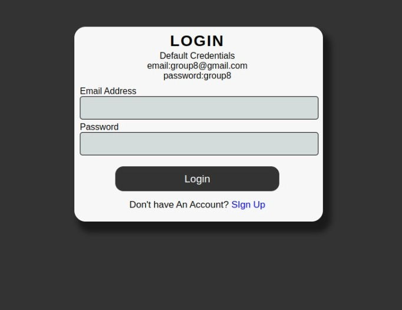
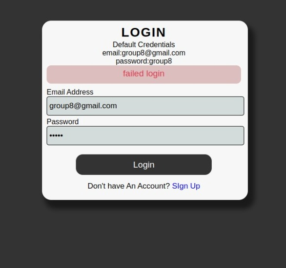
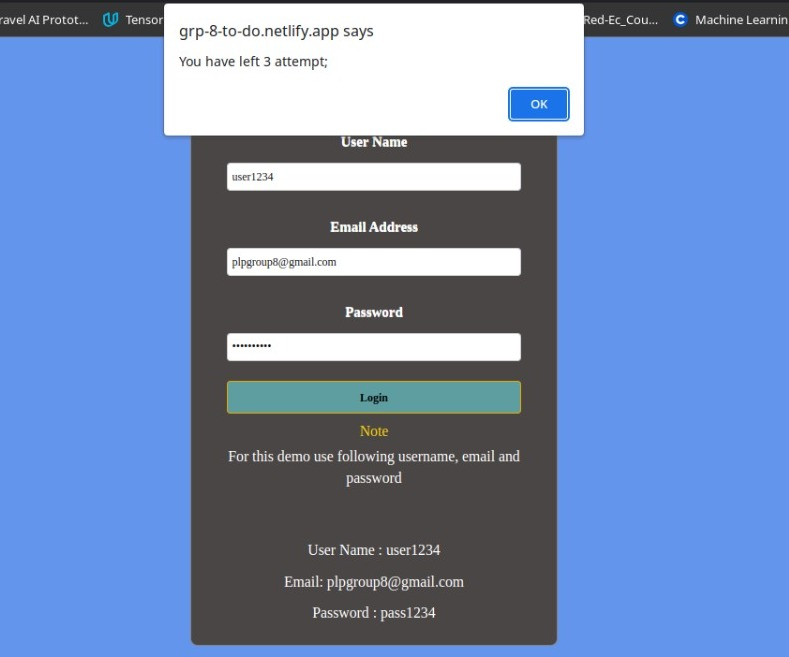
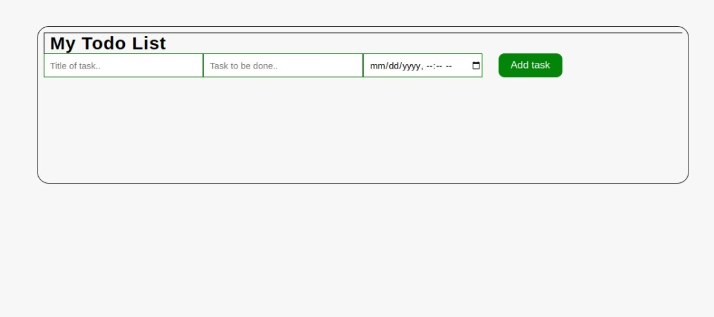
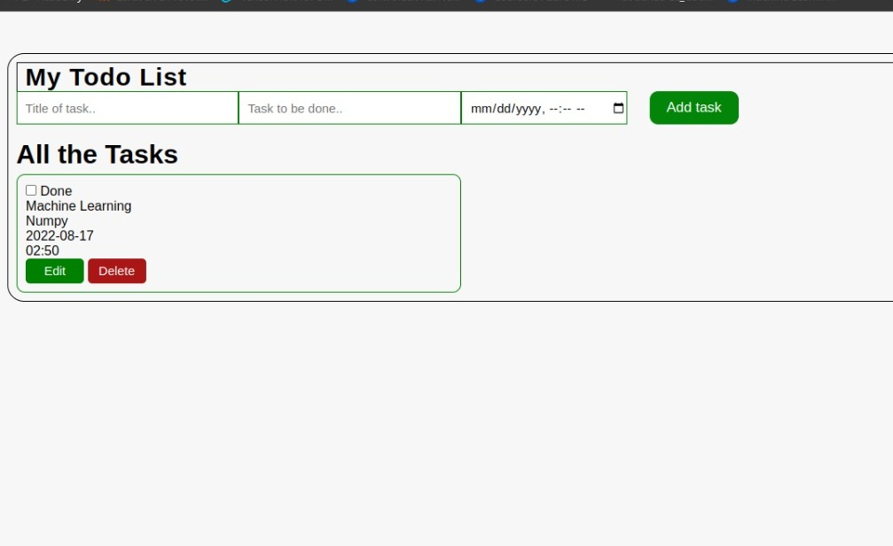
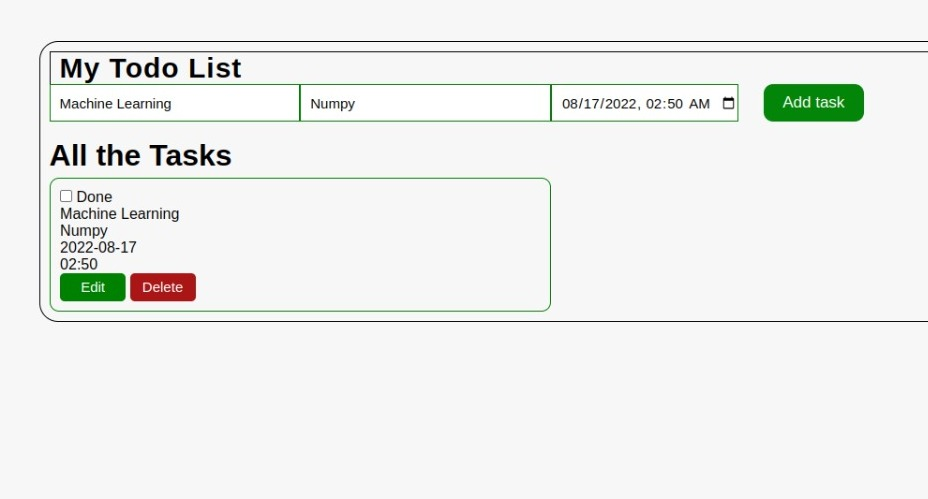
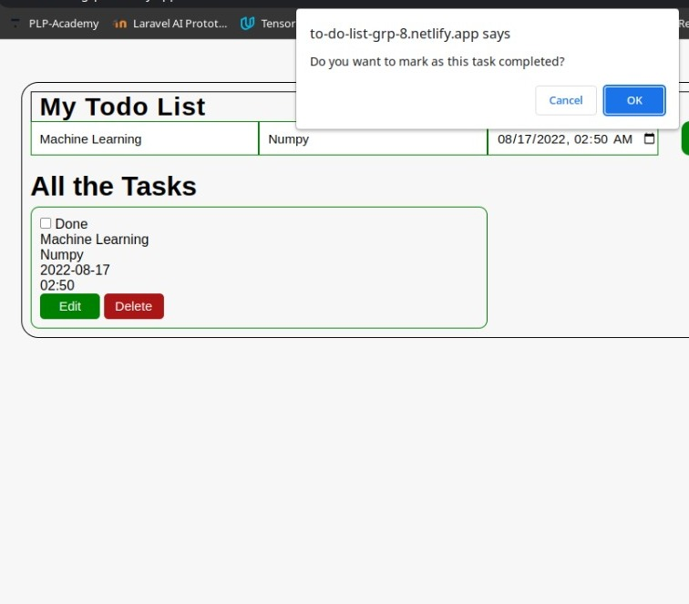
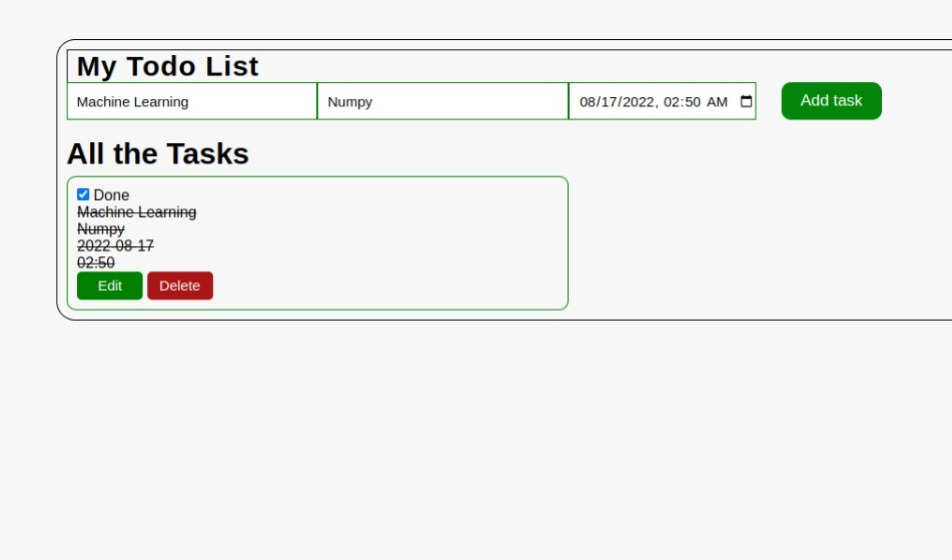

# PLP--Web_Tech--Hackathon--Group-8
This is a web technologies hackathon that was held by PowerLearnProject from 5th of August to 8th of August. The whole team that registered for the hackathon was divided in small groups competing amongst ourselves for a prize of winning 500 dollars. 

# Hackathon Challenges
The hackathon comprised of 4 challenges where the teams were supposed to use only HTML, CSS and vanilla Javascript. No frameworks were supposed to be implemented during the hackathon. After completing all the challenges we deployed them to the internet.
1. Website portfolio ---  use this link to access the site
- suppoed to create a website portfolio that will display the About of the group members, Services that we will be offering, Testimonials of the group members
2. Authentication System ---  use this link to access the site [grp-8-to-do.netlify.app](https://grp-8-to-do.netlify.app/)
- the team created an authentication system that used vanilla Javascript that a login page will authenticate a user. After a successful login, the user will be taken to the To-Do list website.
- login page where a user will use the default credentials to sign in

- now when the user enters wrong credentials an error alert appears and the user is alerted on the number of attempts remaining before the user is locked     out. But after successfully signing in is done, the page will redirect to the To-Do list website 

3. To-Do list --- use this link to access the site [grp-8-to-do.netlify.app](https://grp-8-to-do.netlify.app/)
- After a succesful authentication from the previous challenge, the user will be able to access the To-Do list website where a user is able to create to-do tasks, mark or unmark them as complete, delete the tasks and update them.

- now the user will be able to add new tasks one at a time where several functionalities are available for user's userability

- Editing and updating the already created tasks

- Marking and unmarking. Here the user will be able to mark the tasks as done and also unmark

- and after confirming that the user wants to mark the task as complete  

- Above all the user is able to delete the tasks
4. ATM Machine Web Application --- use this link to access the site [grp-8-atm.netlify.app](https://grp-8-atm.netlify.app/)
- A web application was created that mimics the ATM machine where a user can check for balances, deposit cash , withdraw cash, transfer funds from one account to another, see transaction logs, exit the ATM site.
- System login using default credentials  

- card insertion or account number entry in order to access and transact in the account  

- pin number entry which in this case we used default pin *1379*  

- Available tabs for transaction activities including registered accounts in the *select account* tab  

- Transcation for a selected account  

-- Depositing Cash  

-- Withdrawing Cash  

-- Account Information -- with a printing functionality to print the logs and an exit button 

- Transfer Funds from one account to another  

- Other amaizing functionalities can be access via the website link
# Group 8 Members & Contributers
1. Dedan Okware --- soft.eng.dedan@gmail.com
2. Christian Majani --- christianlogova@gmail.com
3. Edward Kariuki --- kariukiedward06@gmail.com 
4. Fredrick Otiang' --- otiangfredrick576@gmail.com
5. Oriel Kiplangat --- kiplangatoriel@gmail.com
